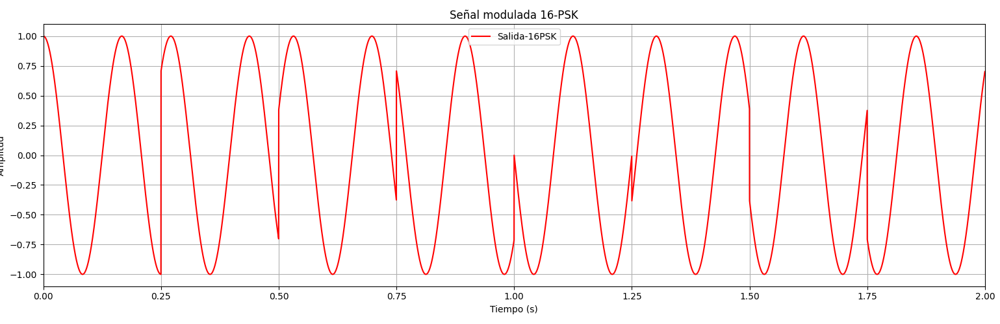

# Communication-Modulation
This repository provides digital modulation techniques, including QPSK,PSK and QAM,using Python.

# 💰 **You can help me by Donating**
<a href="https://www.paypal.com/paypalme/Vivas143"></a> <a href="image/QR_nequi_numero.png"></a>
  


# Python Graphics for Digital Modulation

**The "Digital_Modulation_Py" repository by Kevin-Vivas is a visually captivating resource for exploring various digital modulation techniques, including  QPSK, PSK, and QAM, using Python. Here's a brief summary of its key features:**

- **Visual Code Examples: The repository presents code snippets complemented by visually informative graphics, enabling a clearer understanding and practical application of digital modulation techniques.**

- **Diverse Modulation Techniques: Experience a comprehensive collection of modulation techniques, such as QPSK, PSK, and QAM, through visually engaging demonstrations and intuitive visualizations.**

- **Practical Utility Tools: Benefit from utility functions and classes provided in the repository, which assist in generating waveforms, simulating channel impairments, and analyzing modulation performance metrics.**

- **Advanced Implementation: Advanced practitioners will find convenient Python implementations for digital modulation techniques, allowing for seamless integration into their projects.**

- **Insightful Visual Learning: Visualizations throughout the repository enhance the learning experience, offering deeper insights into the intricacies of digital modulation.**

- **Embark on a visually immersive journey with the "Digital_Modulation_Py" repository. Delve into its contents, leverage the captivating visual materials, and elevate your understanding and proficiency in digital modulation within the realm of communication systems. experimentation.**

**Below are the different images of the digital modulations:**

# QPSK - Quadrature Phase Shift Keying

Image Description |  Image
------------ |  -------------
**QPSK phasor and constellation diagram** |  <br>  1. [QPSK phasor and constellation diagram](https://github.com/Kevin-Vivas/Digital_Modulation_Py/blob/master/QPSK_New/diagramas.py)
**QPSK Eye Digram** |  <br>  2. [QPSK Eye Digram](https://github.com/Kevin-Vivas/Digital_Modulation_Py/blob/master/QPSK_New/QPSK_Digram_Eye.py)
**Modulated_Wave** |  <br>  3. [Modulated_Wave](https://github.com/Kevin-Vivas/Digital_Modulation_Py/blob/master/QPSK_New/qpsk.py)

# PSK Phase Shift Keying
Image Description |  Image
------------ |  -------------
**8-PSK phasor and constellation diagram** |  <br>  1. [8-PSK phasor and constellation diagram](https://github.com/Kevin-Vivas/Digital_Modulation_Py/blob/master/8-PSK/8-PSK.py)
**8-PSK Signal Output** |  <br>  2. [Signal_Output_8PSK](https://github.com/Kevin-Vivas/Digital_Modulation_Py/blob/master/8-PSK/Out-8PSK.py)
**16-PSK phasor and constellation diagram** |  <br>  3. [16-PSK_phasor_and_constellation diagram](https://github.com/Kevin-Vivas/Digital_Modulation_Py/blob/master/16-PSK/16_PSK_Constellation.py)
**16-PSK Signal Output** |  <br>  4. [16_PSK_Signal_Output](https://github.com/Kevin-Vivas/Digital_Modulation_Py/blob/master/16-PSK/16_PSK_Signal_Output.py)
**16-PSK Eye Digram** |  <br>  5. [16-PSK_Eye_Digram](https://github.com/Kevin-Vivas/Digital_Modulation_Py/blob/master/16-PSK/16-PSK_%20Eye%20Diagrams)
**32-PSK phasor and constellation diagram** |  <br> 6.[32_PSK_Diagram_Phasorial_Constellation](https://github.com/Kevin-Vivas/Digital_Modulation_Py/blob/master/32-PSK/Constellation_32PSK.py)
**32-PSK Signal Output** |  <br>  7. [32-PSK_Signal_Output](https://github.com/Kevin-Vivas/Digital_Modulation_Py/blob/master/32-PSK/Output_32_PSK)
**32-PSK Eye Digram** |  <br>  8. [32-PSK Eye Digram](https://github.com/Kevin-Vivas/Digital_Modulation_Py/blob/master/32-PSK/32-PSK_%20Eye%20Diagrams.py)
**Error Rates PSK** |  <br>  9. [Error_Rates_PSK](https://github.com/Kevin-Vivas/Digital_Modulation_Py/blob/master/Error_Rates_PSK/Main.py)

# QAM - Quadrature Amplitude Modulation
Image Description |  Image
------------ |  -------------
**16-QAM phasor and constellation diagram** |  <br>  1. [16-QAM_phasor_and_constellation_diagram](https://github.com/Kevin-Vivas/Digital_Modulation_Py/blob/master/16QAM/16QAM_Constellation_Phasor.PY)
**16-QAM Signal Output** |  <br>  2. [16-QAM_Signal_Output]()
**Error Rates QAM** |  <br>  3. [Error_Rates_QAM](https://github.com/Kevin-Vivas/Digital_Modulation_Py/blob/master/Error_Rates_QAM/QAM_Error.py)

# Recommended_books  
- [Digital Modulations using Python](https://www.gaussianwaves.com/digital-modulations-using-python/)

- [Digital Modulations Libraries using Python ](https://www.gaussianwaves.com/DigiCommPy/modem.html#DigiCommPy.modem.Modem)

#  Required Installations for PowerShell
```powershell
pip install matplotlib
```

```powershell
 pip install sympy
```

